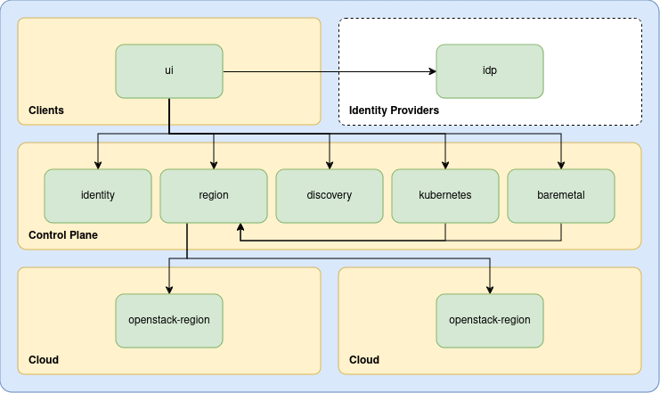

# Unikorn Cloud

## About

Unikorn Cloud is a suite of services to provide high level provisioning of cloud infrastructure.
The goal is to support hands-free life-cycle management of things like Kubernetes and bare-metal clusters.
Underpinning everything is an enterprise grade identity service based on OIDC with integration into all major internet identity providers.

## Architecture

Unikorn is structured as a composable set of micro-services as shown below:

### Components

#### UI

The [UI](https://github.com/unikorn-cloud/ui) drives interactions between a public identity provider (which provides authentication) and the identity service (which provides authorization).

It also presents all component APIs in a simple and easy to consume form.

#### Identity Service

The [Identity Service](https://github.com/unikorn-cloud/identity) acts as primarily as an identity federation layer, wrapping provider specific identity services into an abstract one that can be used by all other services.

It also provides management of role-based access control by providing primitives such as organizations, groups, roles and projects.

#### Region Service

The [Region Service](https://github.com/unikorn-cloud/region) provides cloud region discovery and infrastructure management in an abstract way.
This can range from simple identity management e.g. creating users and cloud credentials, to infrastructure provisioning e.g. networks and virtual manchines, that can be leveraged by inidiviual services.

#### Kubernetes Service

The [Kubernets Service](https://github.com/unikorn-cloud/unikorn) provides Kubernetes-as-a-service on top of other previously described services.

#### Bare-metal Service

The Bare-metal Service provides metal-as-a-service.

#### Discovery Service

**Coming Soon!**

The Discovery Service addresses the fact that Unikorn Cloud is intended to be a flexible and composable system.
Thus you only advertise to clients services, and their endpoints, that are enabled on the platform.
This simplifies client configuration and provides an abstraction layer on top of endpoints.

### Roadmap Items

These items are scheduled for release in the near future...

#### Bare-metal Service

The Bare-metal Service wlll provide metal-as-a-service.

#### Application Service

The Application Service will provide managed application life-cycle management for Kubernetes clusters.

#### Application Gateway

THe Application Gateway will provide deeply integrated Kubenetes Application access leveraging the [Identitiy Service's](https://github.com/unikorn-cloud/identity) authentication and RBAC.
